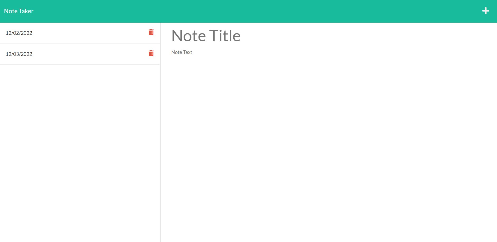

[](https://opensource.org/licenses/MIT)
  
  # Note-Taker
  
  ## Project Description
  Create an application to write and save notes. This application use an Express.js back end and save and retrive
  note data from a JSON file.

  ## Table of Content

  * [Preview](#preview)

  * [Installation](#installation)

  * [Usage](#usage)

  * [License](#license)

  * [Contributing](#contributing)

  * [Question](#question)

  ## Preview
  *Demo Video:*
  https://app.castify.com/view/a4b5c83d-0012-4d98-b6f1-41915e6dea14

  *Main Page:*
  

  *Saving Notes:*
  

  *Taking Notes From DB:*
  

  *Adding Notes:*
  


  ## Installation
  To install the necessary dependencies, run the following commands:
  
  ```
  npm install
  npm install express
  npm install uuid
  ```
  
  ## Usage
  After clone the repository to local machine and install the necessary dependencies, run below command in terminal to start the application:
  ```
  npm start
  ```

  ## License
  This project is licensed under the 

  [](https://opensource.org/licenses/MIT)
  
  ## Contributing
  N/A
    
  ## Question
  * Connect me on [Github](https://github.com/ykuang321)
  * For any additional questions/information, contact me by Email: **kuangye869@gmail.com**
